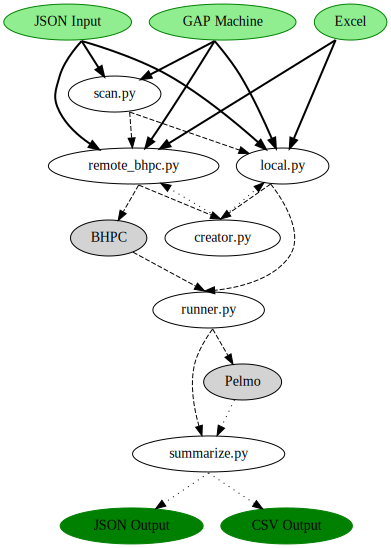

# eEnSa-FocusSteps-Pelmo

This Repository aims to automate interacting with FOCUS PELMO

## Components

The scripts of this project call each other in a chain, with each script adding a additional automation.
If a user already has the requirements for a lower level of automation, for example they don't want to scan a parameter
matrix using [scan.py](focusStepsPelmo%2Fpelmo%2Fscan.py)
but want to simply run a single run with [local.py](focusStepsPelmo%2Fpelmo%2Flocal.py), they can directly call the
lower script.

The full workflow is as follows:



### scan.py

[scan.py](focusStepsPelmo%2Fpelmo%2Fscan.py) is intended to cover parameter matrixes and takes as input a template input
and which range it should use for
different parameters. Each part of this matrix can then either be simply written out or directly be calculated on the
local machine or the BHPC.

### local.py

This script runs the defined runs on the local machine. To keep the machine still usable, it uses one less thread than
the machine has cores, as reported by pythons cpu_count(). It is not required to install PELMO to run this script, as it
uses its own bundled executable, regardless of whether is installed or not.

### remote_bhpc.py

This script runs the defined runs on the BHPC. This primarily makes sense for larger runs as a single PELMO run requires
about 30 CPU seconds and a bhpc instance requires about 10 minutes to start and is billed for at least an hour. For
larger runs however the BHPC can start several 96 core machines, which will greatly reduce the calculation time over
smaller instances and, as long as the time remains above one our, reduce the cost as larger ec2 instances have less
proportional overhead while maintaining the same cost per core.

### Other Scripts

While the other scripts can be directly run from the command line and this may be useful for testing or interacting with
other automations, they are primarily intended for invocation by the other three scripts.

## File Format

This project uses several file format that users should be aware of. They will be listed in this section

### File Naming

Many parts of this workflow generate files. Some only generate a single file of a given type with changing contents
and name the file for the function, e.g. `pelmo.sub`, but most generate large number of files that have no suitable
human understandable name. These files will be universally named along the schema `<hash of contents>.<type of file>`.

### JSON Input

Several of the inputs are json files. These follow the following, nested schema

#### Combined

```json
{
    "gap": GAP,
    "compound": Compound
}
```

#### Compound

```json
{
    "molarMass": float,
    "volatility": Volatility,
    "sorption": Sorption,
    "degradation": Degradation,
    "plant_uptake": float,
    "name": Optional[str],
    "metabolites": List[MetaboliteDescription]
    "model_specific_data": Dict
}
```

#### GAP

```json
{
    "type": str,
    "arguments": Union[MultiGAP, RelativeGAP, AbsoluteConstantGAP, AbsoluteScenarioGAP]
}
```

### GAP Machine

One of the possible inputs is the BAYER GAP Machine. An example of its export output can be found
in [GAP Machine example](examples%2FMI-134523625728_EUR__gw%20GAP%20grouped.gap).
This can be parsed by the scripts into `AbsoluteScenarioGAP` and as such will still require compound information from
another source.

### Excel

The scripts of this project can also parse an Excel input file, if it follows a specified format.
You can find an example [combined.xlsx](examples%2Fcombined.xlsx) here. As the name of the example suggests, it can be
used as both a gap and a compound specification.

### JSON Output

```json
[
  {
    "compound": Compound,
    "gap": GAP,
    "scenario": Scenario,
    "crop": FOCUSCrop,
    "pec": Dict[str, float]
  }
]
```
### CSV Output

The CSV output is simply a flattened version of the JSON output, with keys separated by `.` and list elements indicated
by their index in their column headings.

### JSON classes

#### Volatility

```json
{
    "water_solubility": float,
    "vaporization_pressure": float,
    "reference_temperature": float
}
```

#### Sorption

```json
{
    "koc": float,
    "freundlich": float
}
```

#### Degradation

```json
{
    "system": float,
    "soil": float,
    "soil": float,
    "surfaceWater": float
}
```

#### MetaboliteDescription

```json
{
    "formation_fraction": float,
    "metabolite": Compound
}
```

#### MultiGAP

```json
{
    **GAPcommonargs,
    "timings": List[GAP]
}
```

#### RelativeGAP

```json
{
    **GAPcommonargs,
    "bbch": int,
    "season": Optional[int]
}
```

#### AbsoluteConstantGAP

```json
{
    **GAPcommonargs,
    "time_in_year": Union[datetime, str]
}
```

#### AbsoluteScenarioGAP

```json
{
    **GAPcommonargs,
    "scenarios": Dict[Scenario, AbsoluteConstantGAP]
}
```

#### GAPcommonargs

```json
{
    "modelCrop": FOCUSCrop,
    "rate": float,
    "period_between_application": int,
    "number": int,
    "interval": Union[timedelta, int],
    "model_specific_data": Dict
}
```

## PELMO

Pelmo is a european groundwater model. It takes proprietary inputs and delivers proprietary outputs

### PELMO Input

Pelmo takes requires three files in the working directory, `pelmo.inp`, `input.dat` and a `*.psm` file, which in turn reference several other files by relative path

#### The psm file

As Pelmo predates the creation of even XML its input is sadly no standard format. In this format comments are begun with `<` and end with the end of the line or with a `>`.

In terms of actual content, each line without leading whitespace is a new section, with each space at the start of the line indicating one level of nesting of lists. Every block that starts with whitespace also is one section. Inside one line, the elements of the section are separated with whitespace of arbitrary length. Which sections appear in which order is best discovered by inspecting the `FOCUS_defaults.psm` included with PELMO which is well commented.

### PELMO Output

Pelmos output files are all written in the current working directory and end in `.PLM`. Taken together they are about
2.5 MB in size, which is why this project deletes them after extracting the interesting information from them.

#### PLM format

PLM is a mixture of a space separated tables, typically the interesting data, with one such table per year of simulation
and key value pairs, which differ in formatting from file to file slightly. While these segments sadly do not have a
delimiter between them, they all start with a heading followed by a line of dashes, which can be used to split the PLM
files in parsable chunks. One thing to keep in mind however, is that the seperation of columns sadly is not perfect in
these files. Some Columns are paired as value (variation_of_value) and depending on the value, that space before the
bracket may or may not be there, which has to be taken into consideration when parsing.

#### Finding the PEC

To determine the PEC two files are relevant: `WASSER.PLM` and `CHEM.PLM`, listing the water volume and compound masses respectively. When calculating the PEC one needs to parse each year segment for the line with compartment 21 and extract the relevant column and calculate that years PEC. Then, the first 6 years of warmup have to be excluded and the 80% percentile of the remaining values has to be taken, which is the final result.

